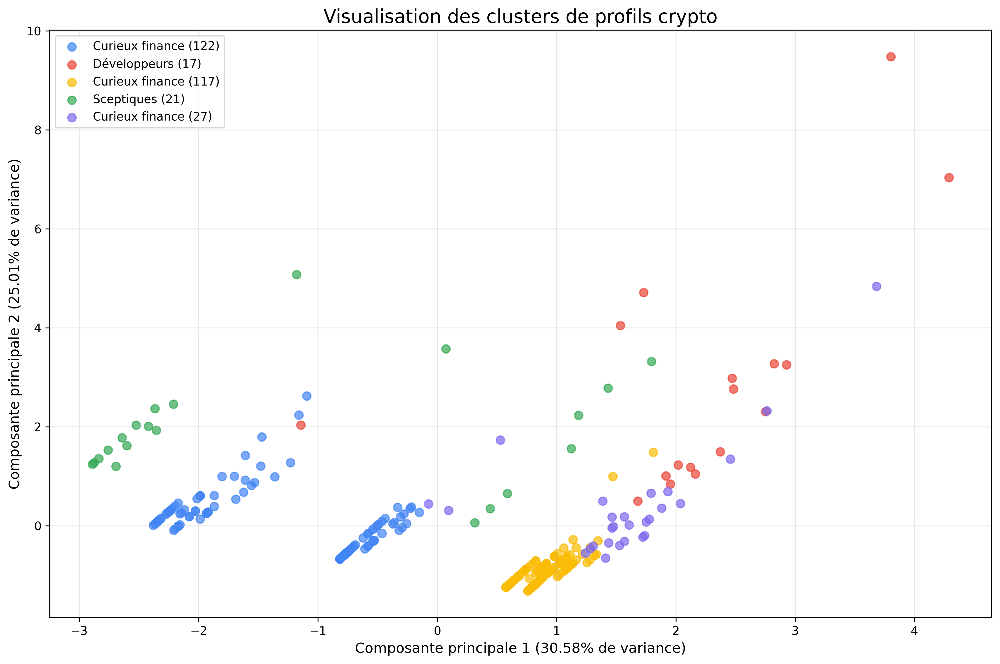

# Cryptobel: Web3 audience segmentation (NLP + clustering)

Code and aggregated results of the data part of my Bachelor final thesis (TFE, EPHEC, 2025), a
**two-person project** for **Cryptobel**: understanding French-speaking crypto / Web3 audiences to support
communication decisions.

Case study (context, method, dashboards, my role): **https://harry-mulembwe.vercel.app/projects/cryptobel/**

> **Privacy.** The collected Reddit and Instagram messages are personal data and are **not** in this
> repository: no raw data, no database, no usernames, no message text, no API keys. Only the code (credentials
> removed) and aggregated outputs are published. A synthetic sample lets you run the scripts.
> See [docs/PRIVACY.md](docs/PRIVACY.md).

## What the pipeline does

```text
Reddit API (praw)  ─┐                 cleaning (emoji, URLs, @mentions,      DistilCamemBERT      TF-IDF + features
                    ├─► SQLite ─────► stop words, crypto vocabulary)  ─────► sentiment  ───────► K-means (k = 2-10,
Instagram (Apify)  ─┘                                                        (distilcamembert)    elbow + silhouette)
                                                                                                        │
                                           profile labels (curious-finance, idealists, developers,  ◄───┘
                                           sceptics), keywords, word clouds, PCA view  ─►  Power BI report (in the TFE)
```

| Step | Script |
|---|---|
| Reddit collection (r/CryptoFr, r/BitcoinFrance, keyword and score filters, 1-year window) | [src/collect_reddit.py](src/collect_reddit.py) |
| Instagram: import of the Apify CSV exports into SQLite | [src/import_instagram_apify.py](src/import_instagram_apify.py) |
| Cleaning, sentiment (DistilCamemBERT), TF-IDF, K-means, profiles, charts - Reddit | [src/cluster_reddit.py](src/cluster_reddit.py) |
| Same pipeline - Instagram | [src/cluster_instagram.py](src/cluster_instagram.py) |

The scripts are the ones used in 2025. Only three things were changed for publication: credentials read from
environment variables, local paths replaced by parameters, and output written under `results/runs/`.

## Results (aggregated, final runs)

| | Reddit | Instagram |
|---|---:|---:|
| Messages collected (posts + comments) | 58 + 361 | 906 + 660 |
| Messages kept after cleaning and clustered | 304 | 341 |
| Clusters (K-means, k chosen with elbow + silhouette) | 5 | 5 |

- Reddit: [cluster summary](results/reddit/cluster_summary.txt). Two large "curious about finance" groups
  (wallets, fees, Binance, Ledger), small developer and sceptic groups.
- Instagram: [cluster summary](results/instagram/cluster_summary.txt). Dominated by idealist / market-talk
  profiles, with small developer and sceptic groups.
- From clusters to profiles: each platform was clustered separately (10 clusters in total). The clusters were then
  interpreted together; clusters with the same discourse were grouped and very small ones (5 to 33 messages on
  Instagram) were not kept as separate profiles. This gave the **six strategic profiles** of the thesis: two on
  Instagram (enthusiastic and disillusioned idealists) and four on Reddit (cautious and enthusiastic financial
  explorers, technical developers, critical sceptics).
- Charts: elbow method, silhouette scores and detail, PCA projection, average features by profile and keyword
  word clouds in [results/reddit/](results/reddit/) and [results/instagram/](results/instagram/).



The interviews (22), the survey and the Power BI report of the thesis are presented on the
[case study page](https://harry-mulembwe.vercel.app/projects/cryptobel/). They are not part of this repository.

## Run it

```bash
python -m venv .venv && .venv\Scripts\activate          # Windows (source .venv/bin/activate elsewhere)
pip install -r requirements.txt
python data/sample/make_synthetic_sample.py             # synthetic databases, same schema as the real ones
python src/cluster_reddit.py                            # uses data/sample/reddit_sample.db by default
python src/cluster_instagram.py                         # uses data/sample/instagram_sample.db by default
```

The first run downloads the `cmarkea/distilcamembert-base-sentiment` model from Hugging Face. Results on the
synthetic sample are only a technical demonstration.

To collect your own data, copy `.env.example` to `.env`, set your own Reddit app credentials, and point
`REDDIT_DB` / `INSTAGRAM_DB` to your databases. Respect the platforms' terms and the GDPR.

## Limitations

- Small samples (304 and 341 messages): clusters describe discussion themes, not a representative population.
- Sentiment comes from a general French model, not fine-tuned on crypto vocabulary.
- Profile labels come from keyword-based scores (developer, idealist, curious-finance, sceptic); they are interpretations, not ground truth.
- The scripts are research code written during the thesis, not a packaged library.

## Author

Harry Mulembwe - Data & Business Analyst - https://harry-mulembwe.vercel.app/
Thesis co-written with a classmate; my own contribution is detailed on the case study page.
